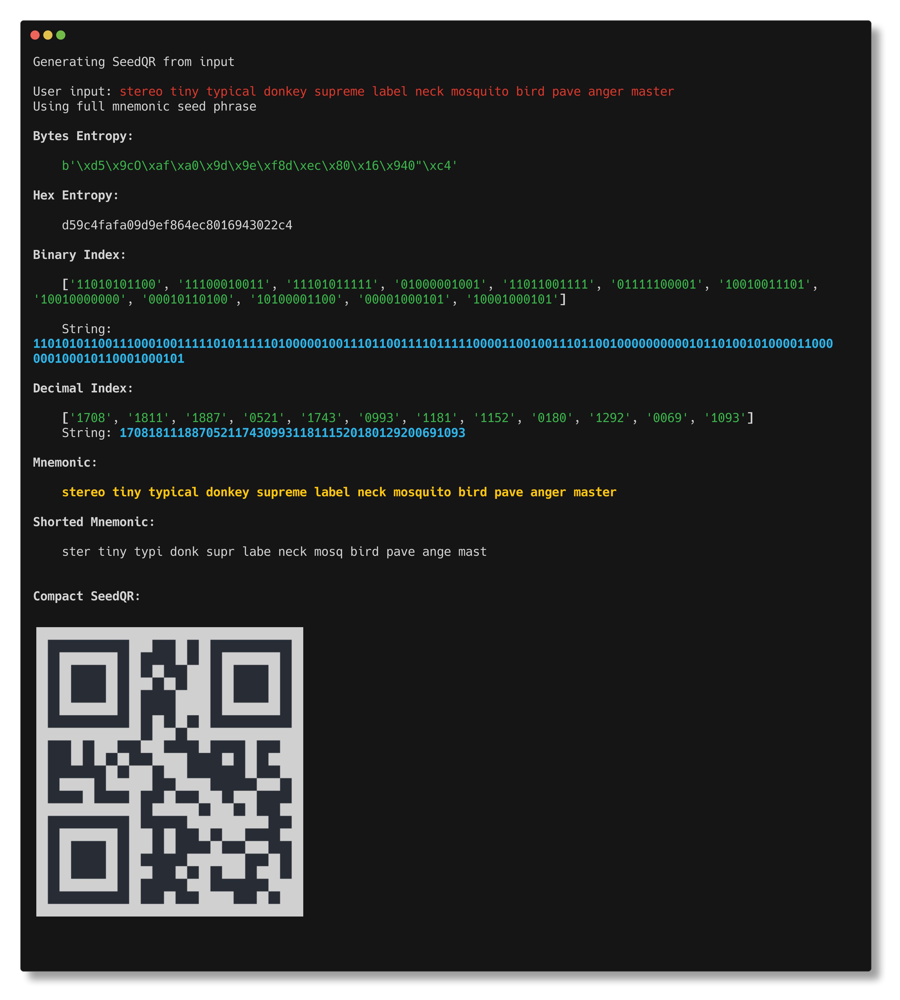

# Table of contents

- [Table of contents](#table-of-contents)
- [Initial recommendetations](#initial-recommendetations)
- [Quick usage](#quick-usage)
- [SeedQR Generator](#seedqr-generator)
  - [Installation](#installation)
  - [seedQR command](#seedqr-command)
    - [Examples](#examples)
  - [bip85 command](#bip85-command)
    - [Examples](#examples-1)
  - [bip39 command](#bip39-command)
    - [Examples](#examples-2)
  - [Display options](#display-options)
- [Reference libraries](#reference-libraries)
- [Tests](#tests)
  - [Testing Compact SeedQR Codes.](#testing-compact-seedqr-codes)
  - [Testing QRs on multiple Wallets (WIP)](#testing-qrs-on-multiple-wallets-wip)
  - [Hardware Wallets](#hardware-wallets)
  - [Software Wallets](#software-wallets)
- [Contributing](#contributing)
  - [Installing the project](#installing-the-project)
  - [Before commiting](#before-commiting)
- [Disclaimer](#disclaimer)

# Initial recommendetations

- This software is for entertainment and educational purposes only.
- Never use this software with any seedphrases that have real assets tied to them.
- If you're willing to use a seedphrase with real funds in it, **do it on an offline device**.
- Read the disclaimer at the end of this README.


# Quick usage

```bash
python3 -m seedqr <command> <input> <arguments>
```

Quick examples:

```bash
python3 -m seedqr seedQR --input "stereo tiny typical donkey supreme label neck mosquito bird pave anger master" --mnemonic
```

```bash
python3 -m seedqr bip85 --master "stereo tiny typical donkey supreme label neck mosquito bird pave anger master" --index 55
```

```bash
python3 -m seedqr bip39 --qty 10 --no-info --hide
```


# SeedQR Generator

This scripts lets you:
- Generate a [Compact SeedQR](https://github.com/SeedSigner/seedsigner/blob/dev/docs/seed_qr/README.md) from provided inputs such as BIP39 12-24-Words Seedphrase. 
- Deconstruct you input seedphrase in their hexadecimal entropy or BIP39 wordlist indexes.
- Derive BIP85 Child Seedphrases from 0 to 2147483647 index (and generate their SeedQR) with or withour passphrase.
- Generate BIP39 Seedphrases.

## Installation

1. Clone or fork this repository. `git clone https://github.com/renkasiyas/seeqQR-generator.git`
2. Create virtual environment. `python3 -m venv .venv`
3. Activate virtual environment. `source .venv/bin/activate`
4. Run the appropiate commands, like `python3 -m seedqr bip39 --qty 1 --print --show`

_For developers look at [Contributing](#contributing)_




## seedQR command

```bash
python3 -m seedqr seedQR [--input "<input>" | --env] <type of input> <display options>
```

Takes an input shows a Compact SeedQR.

- `--input`: is a string in double quotes. Needs to be specified the type of the input with one of the input arguments.
- `--env`: If this is used, it'll look for `.env` file in the root folder. It'll try to load `$USER_INPUT` variable. This supersedes `--input`.

| Type of input    | Description                                                                                                                                                               |
| ---------------- | ------------------------------------------------------------------------------------------------------------------------------------------------------------------------- |
| \--mnemonic      | A valid BIP39 Seedphrase. Length: 12, 15, 18, 21 or 24 words. Like: `"stereo tiny typical donkey supreme label…"`                                                         |
| \--entropy       | Hexadecimal entropy. 128 bits needed for 12 words mnemonic. Example: `"d59c4fafa09d9ef864ec8016943022c4"`                                                                 |
| \--short         | Same mnemonic seedphrase but just the first 4 letters of each word. Example: Instead of `"stereo tiny typical donkey supreme label…` is `ster tiny typi donk supr labe…"` |
| \--decimal-index | One string with all the decimal index values for each word on the mnemonic. Zero-padded. Example: `"170818111887052117430993118111520180129200691093"`                    |
| \--binary-index  | Same as `--decimal-index` but for binary. Example: `"110101011001110001001111101011111010000010011101100111101111100001100100…"`                                           |


### Examples

> `display arguments` are ommitted in the examples for simplicity

```bash
python3 -m seedqr seedQR --input "stereo tiny typical donkey supreme label neck mosquito bird pave anger master" --mnemonic
```

```bash
python3 -m seedqr seedQR --input "ster tiny typi donk supr labe neck mosq bird pave ange mast" --short
```

```bash
python3 -m seedqr seedQR --input "d59c4fafa09d9ef864ec8016943022c4" --entropy
```

```bash
python3 -m seedqr seedQR --input "170818111887052117430993118111520180129200691093" --decimal-index
```

```bash
python3 -m seedqr seedQR --input "110101011001110001001111101011111010000010011101100111101111100001100100111011001000000000010110100101000011000000100010110001000101" --binary-index
```

For all those examples the response is basically the same:

```bash
User input: <input>

Bytes Entropy:

    b'\xd5\x9cO\xaf\xa0\x9d\x9e\xf8d\xec\x80\x16\x940"\xc4'

Hex Entropy:

    d59c4fafa09d9ef864ec8016943022c4

Binary Index:

    ['11010101100', '11100010011', '11101011111', '01000001001', '11011001111', '01111100001', '10010011101', '10010000000', '00010110100', '10100001100', '00001000101', '10001000101']

    String: 110101011001110001001111101011111010000010011101100111101111100001100100111011001000000000010110100101000011000000100010110001000101

Decimal Index:

    ['1708', '1811', '1887', '0521', '1743', '0993', '1181', '1152', '0180', '1292', '0069', '1093']
    String: 170818111887052117430993118111520180129200691093

Mnemonic:

    stereo tiny typical donkey supreme label neck mosquito bird pave anger master

Shorted Mnemonic:

    ster tiny typi donk supr labe neck mosq bird pave ange mast

```


## bip85 command

```bash
python3 -m seedqr bip85 [--master "<input>" | --env] [--qty <int> | --index <int>] <arguments>
```

Takes a `--master` and derive a BIP85 child seedphrase.

Required arguments:

- `--master <input>` or `--env`. 
  - `--master`: is a string in double quotes. Should be BIP39 compliant, 12, 15, 18, 21 or 24 words.
  - `--env`: If this is used, it'll look for `.env` file in the root folder. It'll try to load `$USER_INPUT` variable. This supersedes `--input`.
- `--qty` or `--index`.

| Arguments     | Value               | Description                                                                  |
| ------------- | ------------------- | ---------------------------------------------------------------------------- |
| \--qty        | `int` _Default: 0_  | To derive child addresses in bulk. Valid values from 1 to 100.               |
| \--index      | `int` _Default: 0_  | Derive a specific BIP85 index. Valid values from `0` to `2147483647`         |
| \--passphrase | `str` _Default: ""_ | Add passphrase to salt the mnemonic.                                         |
| \--length     | `int` _Default: 12_ | Length desired for the child seedphrase. Valid lengths: [12, 15, 18, 21, 24] |


### Examples

> `display arguments` are ommitted in the examples for simplicity

This will generate the first child BIP85 seedphrases for the indexes in `qty` argument:
```bash
python -m seedqr bip85 --master "stereo tiny typical donkey supreme label neck mosquito bird pave anger master" --qty 10 --length 12
```

Output:
```bash
Generating BIP85 Child Mnemonic Seed from master seedphrase:
stereo tiny typical donkey supreme label neck mosquito bird pave anger master
Child Mnemonic #0: camera detail spray odor firm badge muscle movie panda attend spike never
Child Mnemonic #1: message pepper beyond report attend game thank pitch ladder know type cage
Child Mnemonic #2: feature duck curtain merge staff spy note weasel room give fatigue clock
Child Mnemonic #3: broom medal deputy gain route plate patch lesson mobile say cart wheel
Child Mnemonic #4: business blue load unhappy hover gun method twenty comfort disorder hurry music
Child Mnemonic #5: connect butter relax fly bacon artist gloom boat gown clarify submit club
Child Mnemonic #6: tide setup then real twin entire gossip defense liquid about embrace maze
Child Mnemonic #7: captain crucial fantasy puzzle twice rabbit mixture phone kingdom company mandate fiction
Child Mnemonic #8: fatigue grab off ordinary scheme diagram rain advice treat bar inflict extend
Child Mnemonic #9: hero tourist prison october divorce doll pool other collect scrap local priority
```

This will generate a specific BIP85 child `index`.
```bash
python -m seedqr bip85 --master-mnemonic "stereo tiny typical donkey supreme label neck mosquito bird pave anger master" --index 666 --length 24
```

Output:
```bash
Generating BIP85 Child Mnemonic Seed from master seedphrase:
stereo tiny typical donkey supreme label neck mosquito bird pave anger master
Child Mnemonic #666: pottery collect powder chunk roast distance fabric journey subject thing decrease second isolate fat leg deer language canoe search vintage news silly smile mystery
```

## bip39 command

```bash
python3 -m seedqr bip39 --qty <int> <display options>
```

Generates a valid BIP39 seedphrase.

| Arguments | Value               | Description                                                            |
| --------- | ------------------- | ---------------------------------------------------------------------- |
| \--qty    | `int` _Default: 0_  | To generate seedphrases in bulk. Valid values from 1 to 100.           |
| \--length | `int` _Default: 12_ | Length desired for the seedphrase. Valid lengths: [12, 15, 18, 21, 24] |


### Examples
> `display arguments` are ommitted in the examples for simplicity

```bash
python -m seedqr bip39 --qty 1
```


## Display options

| Arguments   | Values                  | Description                                                                     |
| ----------- | ----------------------- | ------------------------------------------------------------------------------- |
| \--no-info  | `bool` _Default: False_ | Print in console equivalent information from the input or the requested output. |
| \--hide-qr  | `bool` _Default: False_ | Shows Compact SeedQR in the terminal stdout.                                    |
| \--save     | `bool` _Default: False_ | Save QR on filesystem. Filename `seedQR.png` unless `--filename` specified.     |
| \--filename | `str` _Default: None_   | Filename to save the QR. Images are saved on `output/` directory.               |

# Reference libraries

- [Seedsigner's SeedQR Format Specification](https://github.com/SeedSigner/seedsigner/blob/dev/docs/seed_qr/README.md).
- [Reference implementation for BIP85](https://github.com/ethankosakovsky/bip85).
- [Reference implementation for BIP39](https://github.com/trezor/python-mnemonic)

# Tests

Test framework is being built in `seedqr/tests`. Asserting completeness of the tests vectors is validated through [Ian Coleman's BIP39 site](https://iancoleman.io/bip39/). You can run tests with `pytest`.

## Testing Compact SeedQR Codes.
[`Here`](qr-tests/Compact-SeedQR/) are the 9 test vectors specified in the [Seedsigner's SeedQR Format Specification](https://github.com/SeedSigner/seedsigner/blob/dev/docs/seed_qr/README.md). All 9 files generated with the command `python -m seedqr seedQR --input {input from the test vector} {input type} --save --filename test-vector-{number}`

## Testing QRs on multiple Wallets (WIP)

I'm testing the following QR contents with some hardware and software wallets. If you want to contribute, you can use the PNGs located in [`qr-tests`](qr-tests/). All examples are from 12 words mnemonics. Correct BIP32 Root Fingerprint is `8ACDF1D4`.

## Hardware Wallets

| QR Content                                    | File                          | Blockstream Jade                                  |
| --------------------------------------------- | ----------------------------- | ------------------------------------------------- |
| Entropy in Bytes aka *Compact SeedQR*         | 12-entropy-bytes.png          | ✅                                                 |
| Entropy in Hexadecimal                        | 12-entropy-hex.png            | ⚠️ (it loads, but a different wallet fingerprint) |
| Entropy in Decimal Integer                    | 12-entropy-dec.png            | ❌                                                 |
| BIP39 Seedphrase                              | 12-bip39-seedphrase-full.png  | ✅                                                 |
| BIP39 Seedphrase Shorted (4 letters per word) | 12-bip39-seedphrase-short.png | ✅                                                 |
| BIP39 Binary Indexes                          | 12-bip39-index-bin.png        | ❌                                                 |
| BIP39 Decimal Indexes                         | 12-bip39-index-dec.png        | ✅                                                 |
| BIP39 Seed                                    | 12-bip39-seed.png             | ❌                                                 |
| BIP32 Root Key (xprv)                         | 12-bip32-xprv.png             | ❌                                                 |


## Software Wallets

| QR Content                                    | File                          | BlueWallet |
| --------------------------------------------- | ----------------------------- | ---------- |
| Entropy in Bytes aka *Compact SeedQR*         | 12-entropy-bytes.png          | ❌          |
| Entropy in Hexadecimal                        | 12-entropy-hex.png            | ❌          |
| Entropy in Decimal Integer                    | 12-entropy-dec.png            | ❌          |
| BIP39 Seedphrase                              | 12-bip39-seedphrase-full.png  | ✅          |
| BIP39 Seedphrase Shorted (4 letters per word) | 12-bip39-seedphrase-short.png | ✅          |
| BIP39 Binary Indexes                          | 12-bip39-index-bin.png        | ❌          |
| BIP39 Decimal Indexes                         | 12-bip39-index-dec.png        | ❌          |
| BIP39 Seed                                    | 12-bip39-seed.png             | ❌          |
| BIP32 Root Key (xprv)                         | 12-bip32-xprv.png             | ❌          |


# Contributing

Any contribution is welcomed. You can test QR on devices, make new implementations, improve the code, test framework or propose use cases.

If you're making a PR, please use [poetry](https://python-poetry.org/docs/) as package manager.

## Installing the project

```bash
curl -sSL https://install.python-poetry.org | python3 -
poetry install # Instead of activating virtual environment
poetry run <command> 
```

## Before commiting

```bash
poetry run black .
poetry run isort .
poetry run pytest seedqr/tests
```

_(I'll implement a `pre-commit` soon.)_

# Disclaimer

> ⚠️ This project is for informational and entertainment purposes only. 
> 
> You should not construe any such information or other material as legal, tax, investment, financial, or other advice. Nothing contained here constitutes a solicitation, recommendation, endorsement, or offer by me or any third party service provider to buy or sell any securities, financial instruments, hardware producys in this or in any other jurisdiction in which such solicitation or offer would be unlawful under the securities laws of such jurisdiction. 
> 
> If you plan to use real money, USE AT YOUR OWN RISK. Under no circumstances will I be held responsible or liable in any way for any claims, damages, losses, expenses, costs, or liabilities whatsoever, including, without limitation, any direct or indirect damages for loss of assets.